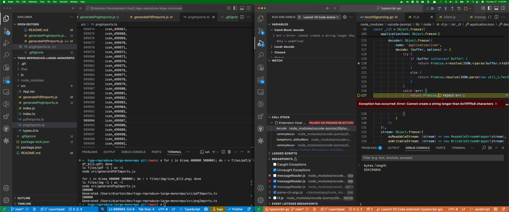

# TypeScript-Go LSP Resolution Issue Reproduction

This repository demonstrates a TypeScript path resolution issue when using paths get watched like modules. 

```typescript
import icon_1 from '../files/img/icon_1.png';
```
gets added as a module `icon_1.png` and causes an overflow from a bunch of resolver options and ultimately a caught error in `node_modules/vscode-jsonrpc/lib/node/ril.js:155` (`#decoder`)
```
Exception has occurred: Error: Cannot create a string longer than 0x1fffffe8 characters
```
or exactly 512MB. Related [StackOverflow thread here](https://stackoverflow.com/questions/68230031/cannot-create-a-string-longer-than-0x1fffffe8-characters-in-json-parse/68263704#68263704)

. 

## Project Structure

```
├── files/                 # you create this with the scripts below
│   │── png
│   │   └── png_N.png      # PNG file number N to be imported
│   └── pdf
│       └── pdf_N.pdf      # PDF file number N to be imported
├── js/
│   └── utils.js          # JavaScript utilities (mapped to @slack/*)
├── src/
│   ├── pngImports.ts     # Component with problematic import
│   ├── pdfImports.ts     # Component with problematic import
│   ├── types.d.ts        # TypeScript declarations, where the pdf/png should resolve to
│   └── App.tsx           # ignore but leaving for later
├── package.json
└── tsconfig.json         # TypeScript config with custom paths
```

### Generating the empty files to reference
The png files were created by seeding empty files with these commands. 
- Giving you a repro repo (say that 5 times fast) isn't realistic for a problem like this, because the repo size would be pretty big. Instead, here are the steps to generate 800k (blank) files in a few seconds.
- Then, a script to fill out some file importing them (`pngImports.ts`)
- Testing limits:
	- 10k pdfs, 10k pngs: ~16mb 🚫
	- ...
	- 500k pdfs, 500k pngs: ~650mb (654194844 bytes) ✅
	- This is of course achievable by using longer string names and less files, but who cares this is just for repro.
- 20k files wasn't nearly enough. 200k was around 160mb, so 800k is surely over 512mb right? 
   - It's around 650mb of a file stream that causes the crash.
- Putting all 800k imports into one file breaks other things for not clear, but understandable reasons, so it's broken into fake PDFs and fake PNGs

```bash
npm i

mkdir files files/pdf files/img

for i in $(seq 400000 500000); do : > files/pdf/pdf_${i}.pdf; done
ls files/pdf -1 | wc -l
node src/generatePdfImports.js 

for i in $(seq 400000 500000); do : > files/img/icon_${i}.png; done
ls files/img -1 | wc -l
node src/generatePngImports.js 
```

## Repro
1. Run the above steps
2. Open tsgo locally and start a debug session (using [their instructions](https://github.com/microsoft/typescript-go/?tab=readme-ov-file#running-lsp-prototype))
3. Enable the breakpoint for `Uncaught Exceptions`
4. In the new vscode debug window, open this repro repo
5. Open one of the import files (e.g. `src/pdfImports.ts`)
6. You may hit breakpoints for unrelated exceptions, just continue until you get into `ril.js`
6. See the error caught reflected in both windows after some time (~10s)

## The Issue

In `src/App.tsx`, we have an import that uses this relative traversal:
```typescript
import pdf_1 from '@slack/../../files/pdf/pdf_1.pdf';
```
Normally this works fine with `tsc`.

However, in `tsgo`, the file watcher adds a bunch of extra files thinking that the direct file reference is a module.

The (oversized) buffer will look like:
```json
First 5,000 of buffer
	{"jsonrpc":"2.0","id":"ts4","method":"client/registerCapability","params":{"registrations":[{"id":"watcher-3","method":"workspace/didChangeWatchedFiles","registerOptions":{"watchers":[
		{"globPattern":"/this_repo/files/pdf_1.d.pdf.ts","kind":1},
		{"globPattern":"/this_repo/files/pdf_1.pdf.d.ts","kind":1},
		{"globPattern":"/this_repo/files/pdf_1.pdf.js","kind":1},
		{"globPattern":"/this_repo/files/pdf_1.pdf.jsx","kind":1},
		{"globPattern":"/this_repo/files/pdf_1.pdf.ts","kind":1},
		{"globPattern":"/this_repo/files/pdf_1.pdf.tsx","kind":1},
		{"globPattern":"/this_repo/files/pdf_1.pdf/index.d.ts","kind":1},
		{"globPattern":"/this_repo/files/pdf_1.pdf/index.js","kind":1},
		{"globPattern":"/this_repo/files/pdf_1.pdf/index.jsx","kind":1},
		{"globPattern":"/this_repo/files/pdf_1.pdf/index.ts","kind":1},
		{"globPattern":"/this_repo/files/pdf_1.pdf/index.tsx","kind":1},

		// repeat all these for all the files, 650MB in this case
		// ...
```


**Expected behavior**: Historically, the TypeScript compiler resolved the path to `src/types.d.ts`'s definition of that file type. Ideally it wouldn't try to watch all these other file "options"


## Notes
- This is a minimal reproduction case
- The PDF/PNG file is just a text placeholder for demonstration purposes
- The project mixes TypeScript (.tsx) and JavaScript (.js) files
- I kept crashing things and started over once or twice, so if I'm missing a repro step, sorry!
